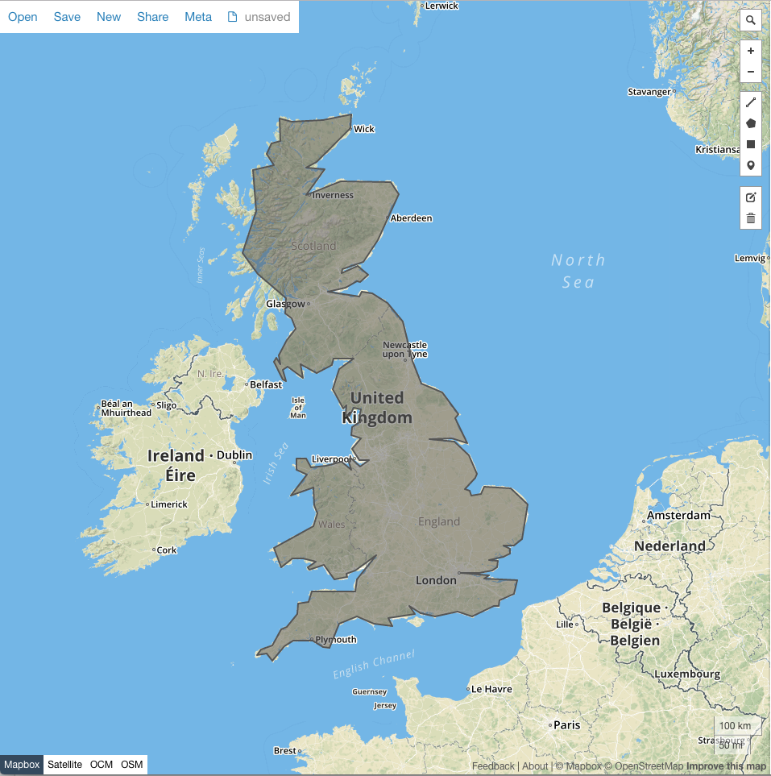
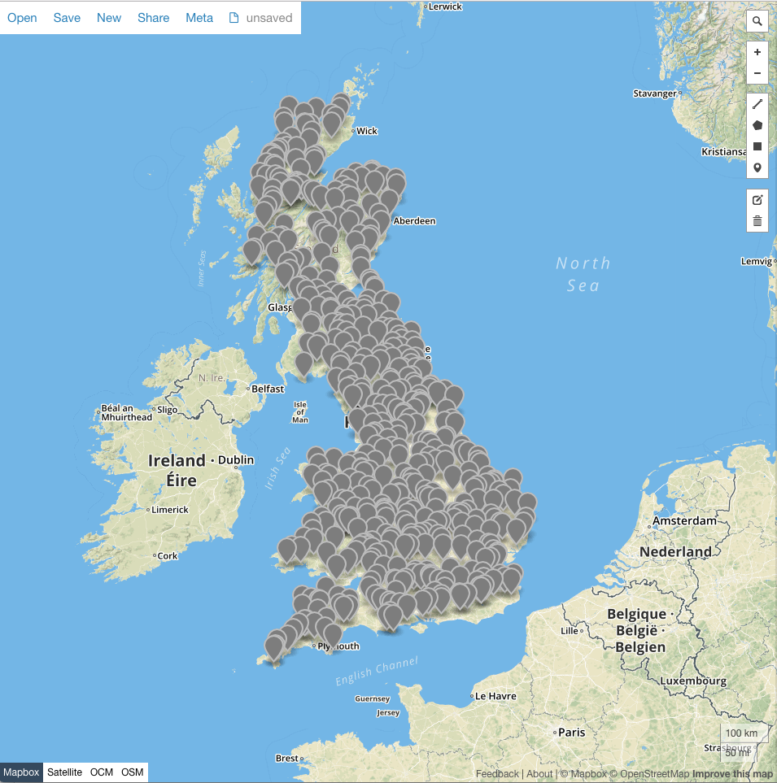

# bulk-position-generator
Scala Akka Streams App for generating a configurable number of Coordinates within a specified Geofence

### Getting started
The app looks at src/main/resources/uk-geofence.json for the Geofence to create Coordinates within (configurable). It accepts GeoJson but only polygons for now (but could support more)

You can change the polygon defined in this file, I used [geojson.io](geosjon.io) to draw a geofence of the United Kingdom for demo purposes:

The application is run by running the Main object. You can use the positionCount variable to define how many Coordinates you'd like generating within the Geofence

### Performance

The app demonstrates two variants of Akka Streams, both using mapAsyncUnordered to delegate CPU intensive tasks. Using this mechanism you can specify an optimised threadpool to handle this workload, whilst the rest of the app remains responsive.

The first mapAsyncUnordered variant uses an Actor outside of the stream to handle the work. While this correctly handles baskpressure and demonstrates the ability to send work to dedicated actors, it has an intentional flaw. To demo how easy it is to get confused in the Actor pattern, even though 30 asynchronous requests will be made to the Actor, they will all get queued in its mailbox and processed sequentially. Effectively you're forcing all the work to be sequentially processed by one Actor.

The second mapAsyncUnordered variant gets around this by instantiating a singleton geofence filter which is threadsafe. The calls made to this are all made in parallel, and therefore increases utilisation.

Testing for 100,000 Coordinates:

<table>
    <tr>
        <td>First Variant</td>
        <td>10.045864232 seconds</td>
    </tr>
    <tr>
        <td>Second Variant</td>
        <td>6.983210143 seconds</td>
    </tr>
</table>

Another consideration is the "sweet spot" for number of asynchronous tasks. Not so much of an issue with the Actor based version (as they just queue messages concurrently, the work is still done sequentially).
However, overloading the second variant can cause a degredation, as is shown by dropping the mapAsyncUnordered parameter from 30 to 10 concurrent messages:

<table>
    <tr>
        <td>30 Concurrent Messages</td>
        <td>6.983210143 seconds</td>
    </tr>
    <tr>
        <td>10 Concurrent Messages</td>
        <td>5.323304329 seconds</td>
    </tr>
</table>

These tests were done by sending all results to a Sink.ignore, to prevent IO affecting results. This can be replaced with the commented out line to write GeoJson compatible Coordinates to a file (need to manually attach GeoJson header and footer currently).

Generating 1000 Coordinates produces the following:

